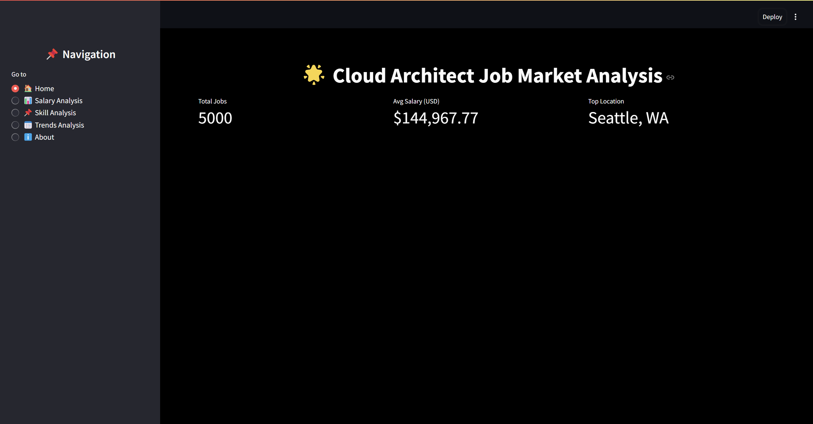

# RTJMT
=======


## Cloud Architect Job Market Analysis

An interactive dashboard to analyze job market trends, salary benchmarks, and skill demands for cloud architect roles using Streamlit and Plotly.

## Table of Contents
- [Description](#description)
- [Features](#features)
- [Installation](#installation)
- [Usage](#usage)
- [Dashboard Preview](#dashboard-preview)
- [Contributing](#contributing)
- [License](#license)
- [Acknowledgements](#acknowledgements)

## Description
The Cloud Architect Job Market Analysis Dashboard provides actionable insights using real-world data. By visualizing salary trends, regional job demands, and key skill requirements, it helps professionals, recruiters, and market analysts make data-driven decisions.

### Key Features Include:
- Salary distribution comparison across different locations.
- Skill analysis to determine in-demand technologies.
- Trends visualization using date-based filtering and moving averages.

## Features
- 📊 **Interactive Salary Analysis:** Compare salaries based on experience and location.
- 📅 **Trend Analysis:** Identify salary fluctuations using a time-series graph.
- 📌 **Skill Demand Visualization:** Discover the most in-demand skills for cloud architects.
- 🖼️ **Customizable Data Views:** Filter data dynamically with intuitive controls.

## Installation
Follow these steps to install and run the project:

1. Clone the repository:
```bash
 git clone https://github.com/yourusername/cloud-architect-job-market.git
 cd cloud-architect-job-market
```

2. Create a virtual environment and activate it:
```bash
 python -m venv venv
 source venv/bin/activate # On Windows use venv\Scripts\activate
```

3. Install dependencies:
```bash
 pip install -r requirements.txt
```

## Usage
1. Ensure the dataset is available in the specified directory.
2. Run the application using Streamlit:
```bash
 streamlit run main.py
```
3. Use the sidebar to navigate through different analysis sections.

## Dashboard Preview
![Dashboard Preview]


## Contributing
Contributions are welcome! To contribute:
- Fork the repository.
- Create a new branch.
- Commit your changes.
- Submit a pull request.

For major changes, please open an issue to discuss.

## License
This project is licensed under the MIT License. See the [LICENSE](LICENSE) file for details.

## Acknowledgements
- **Streamlit** for frontend development.
- **Plotly** for visualizations.
- **Pandas** for data manipulation.
- Thanks to the open data sources for providing the dataset.

---
>>>>>>> 370f67c (Initial Push)
