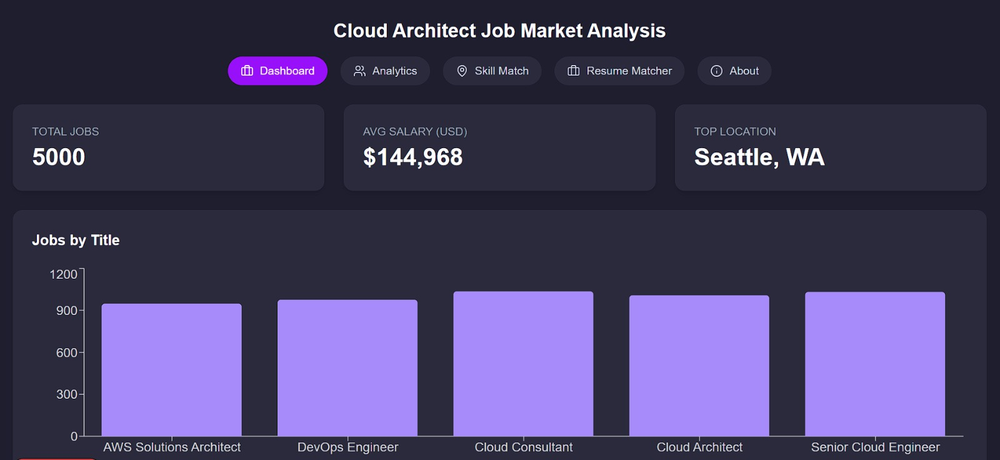

# RTJMT
=======


# 🌐 Cloud Architect Job Market Dashboard

This is a dynamic and interactive web dashboard designed to help **job seekers**, **HR analysts**, and **career planners** understand the Cloud Architect job market. It offers powerful visualizations, skill-based filtering, salary trend analysis, and resume-to-job matching.

## 📦 Contents

- `jobData.json`: Final validated dataset used in the application
- `page.js`: Main frontend code written in React with Tailwind CSS and Recharts
- `Data_Validation_and_Transformation.xlsx`: Excel file showing raw and cleaned data used in the dashboard
- `jobData_cleaned_final.json`: Final processed data after transformation and validation
- `expanded_cloud_architect_jobs.csv`: Raw data before transformation

---

## 🚀 Features

- 📊 **Dashboard View**: Total jobs, average salaries, and top hiring locations
- 📈 **Analytics Tab**: Salary breakdown by role, location, and time
- 🧠 **Skill Match Tab**: Filter jobs based on user-selected skills
- 📂 **Resume Matcher**: Upload a `.txt` or text-based `.pdf` resume and get matched job results
- 📍 **Filters**: Skill, experience level, and location

---

## 📁 Dataset Source & Transformation

The original dataset was loaded from `expanded_cloud_architect_jobs.csv`, then:

- Cleaned for null values and outliers
- Standardized salary values and date formats
- Normalized skill strings (trimmed, lowercased, deduplicated)
- Computed metrics like average salaries by title/location/month

These transformation steps are documented in the `Data_Validation_and_Transformation.xlsx`.

---

## 🛠️ Tech Stack

- **Frontend**: React.js, Tailwind CSS, Recharts, day.js
- **Data Format**: JSON
- **Language**: JavaScript (ES6+)

---

## 🧪 How to Run

1. Clone this repository  
   ```bash
   git clone https://github.com/yourusername/cloud-architect-dashboard.git
Navigate to the project directory

bash
Copy
Edit
cd cloud-architect-dashboard
Install dependencies

bash
Copy
Edit
npm install
Start the development server

bash
Copy
Edit
npm run dev
🎓 Learning Outcomes
Data validation and preprocessing in Python/Excel

Frontend filtering and state management in React

Salary visualization using Recharts

Resume skill matching logic

Human-centered design and presentation
